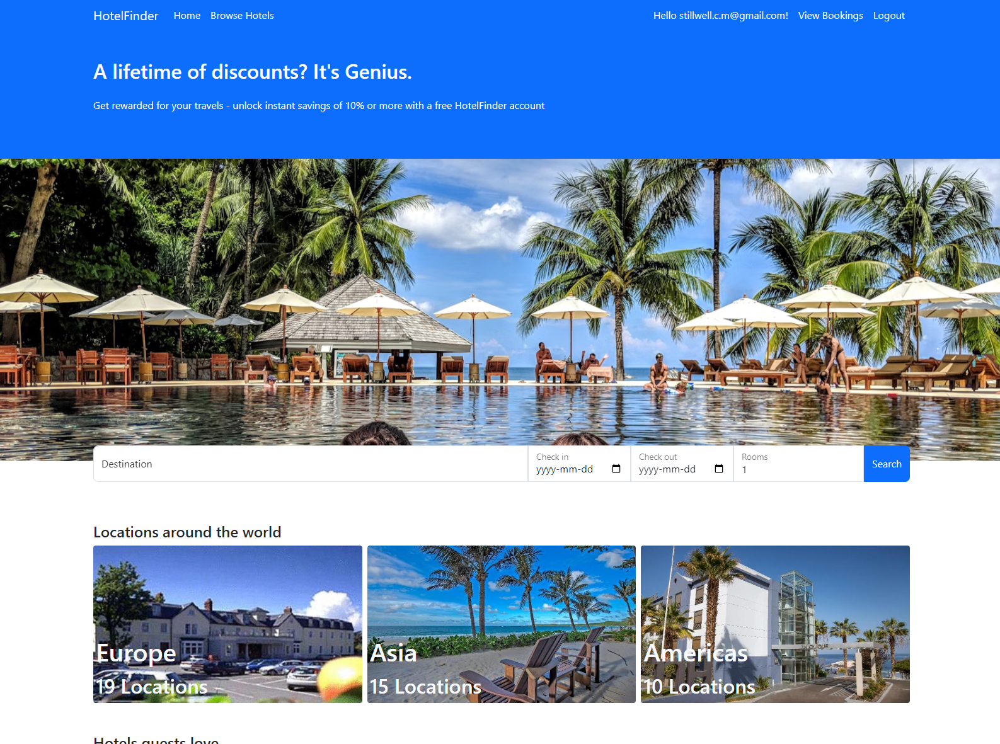
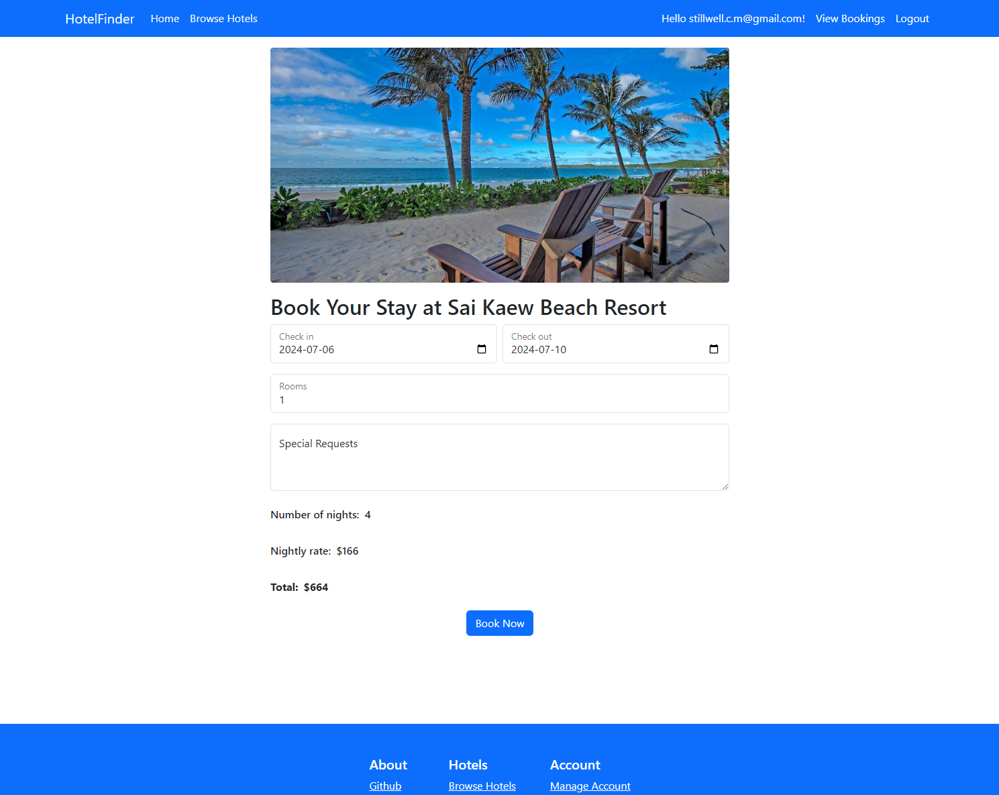

# 호텔 파인더

이 리포지토리는 ASP.NET Core 8 MVC로 만든 호텔 예약 애플리케이션입니다.

## Demo

애플리케이션은 [여기](https://aspmvchotelapp.azurewebsites.net/)에서 사용할 수 있습니다.

## 차례

- [내용](#내용)
  - [요약](#요약)
  - [상세 내용](#상세-내용)
    - [UI](#ui)
    - [API & 인증](#api--인증)
      - [사용자 & 인증](#사용자--인증)
    - [사용자 및 호텔, 예약](#사용자-및-호텔-예약)
    - [검증](#검증)
    - [클린 아키텍처](#클린-아키텍처)
- [스크린샷](#스크린샷)
  - [데스크탑](#데스크탑)
  - [모바일](#모바일)

## 내용

### 여약

- ASP.NET Core 8 MVC
- 반응형 모바일 퍼스트 (mobile-first) UI
- Bootstrap
- jQuery
- Microsoft Azure
- 사용자 등록
- 호텔 검색
- 호텔 예약 생성/수정/삭제

### 상세 내용

이 애플리케이션은 ASP.NET Core 8 MVC의 핵심 기능을 연습하기 위해 사용자 인증을 포함한 간단한 CRUD 애플리케이션입니다.

#### UI

작은 모바일 화면부터 큰 컴퓨터 디스플레이까지 잘 작동하도록 반응형 모바일 퍼스트 (mobile-first) 방식으로 UI를 만들었습니다. Bootstrap을 사용한 경험이 없어서 이번에 배우기 위해 Bootstrap을 사용해보았습니다. Bootstrap만으로 반응형 UI 디자인이 어려운 부분이 있어서 CSS도 조금 사용했습니다. 신속한 개발을 위해 Bootstrap 컴포넌트인 캐러셀과 모달, 내비게이션 바, 경고창을 활용했습니다.

#### API & 인증

##### 사용자 & 인증

계좌 등록과 인증은 ASP.NET Core Identity API로 처리합니다. 사용자가 이메일과 암호로 등록한 후에 로그인을 할 수 있습니다. ASP.NET Core Identity API의 기능을 크게 변경하지 않았으며 앞으로 기본 ASP.NET 프로젝트와 구별되도록 UI를 변경할 예정입니다.

#### 사용자 및 호텔, 예약

네비게이션 바에 있는 Sign in / Register 버튼을 클릭하면 이메일과 암호로 계정를 만들 수 있습니다. 현재 이메일 인증 기능이 별도로 설정되지 않았으므로 등록 후에는 계정 등록 인증 페이지로 바로 이동합니다. 이 페이지의 링크를 클릭한 후에 로그인할 수 있습니다.

이 [데이터](https://gist.github.com/Thaer-Sarakbi/e92e818f0a2c9d5467cf68e8c8833d65)를 사용하여 데이터베이스 시드를 생성했습니다. 데이터를 크게 변경하지 않고 C#에 맞게 형식을 전환하였으며 호텔 모델에 필요한 시간대를 모든 호텔에 추가했습니다.  

사용자가 로그인하지 않은 상태에서도 호텔을 검색하고 호텔 페이지를 볼 수 있지만 예약과 관련된 작업(새 예약 생성, 기존 예약 찾기 등)을 하려면 로그인이 필요합니다. 사요자는 호텔 예약 체크아웃 날짜가 지나지 않은 현재 예약을 수정할 수 있습니다. 현재 예약은 View Bookings 페이지에서 확인할 수 있으며 수정 및 삭제는 각각의 버튼을 통해 가능합니다. "All Bookings" 탭을 클릭하면 날짜에 관계없이 모든 예약을 볼 수 있습니다. 예약을 삭제할 경우 완료 여부를 알려주는 알림이 표시되며, 예약을 수정할 경우에는 예약 상태를 표시하는 페이지로 리디렉션됩니다.

데이터베이스는 SQL 데이터베이스이며 Entity Framework Core ORM을 이용하여 구성했습니다. 프로젝트 코드 내에는 테스트 데이터베이스도 포함되어 있으며, 프로젝트 환경을 "QA"로 설정하면 이 데이터베이스가 기본으로 사용됩니다.

#### 검증

모델 검증은 데이터의 적합성을 보장합니다. 사용자가 제출하는 주요 데이터 예약은 기본적인 모델 검증도 포함하여 예약 가격 계산과 사용자 인증, 체크인과 체크아웃 날짜의 유효성를 확인하는 맞춤형 Validation Attribute Class도 포함됩니다. 체크인 날짜 Validation Attribute Class는 호텔의 시간대를 기준으로 날짜 유효성을 검증합니다.

검증이 실패할 경우 예약 생성 및 수정 입력 양식에는 문제를 설명하는 맞춤형 오류 메시지가 표시됩니다.

체그인 날짜 입력과 체크아웃 날짜 입력에 입력할 수 있는 최소 날짜를 정하기 등 jQuery를 이용하여 일부 프런트엔드 입력 양식 검증하는데 브라우저의 개발자 도구(dev tools) 등으로 프런트엔드 검증을 쉽게 무효화할 수 있기 때문에 백엔드에서도 사용자가 제출한 데이터를 데이터베이스에서 저장하기 전에 검증합니다.  

#### 클린 아키텍처

이 애플리케이션은 향후 유지보수와 유연성을 고려하여 모델, 비즈니스 로직, 데이터베이스, UI 등이 서로 분리된 유스케이스 (use case) 기반의 클린 아키텍처로 구성되었습니다.

## 스크린샷

### 데스크탑

#### Homepage

#### Hotel Search

#### Hotel Page Image Carousel

#### Hotel Booking

#### View Bookings

### 모바일

#### Homepage

#### Hotel Search

