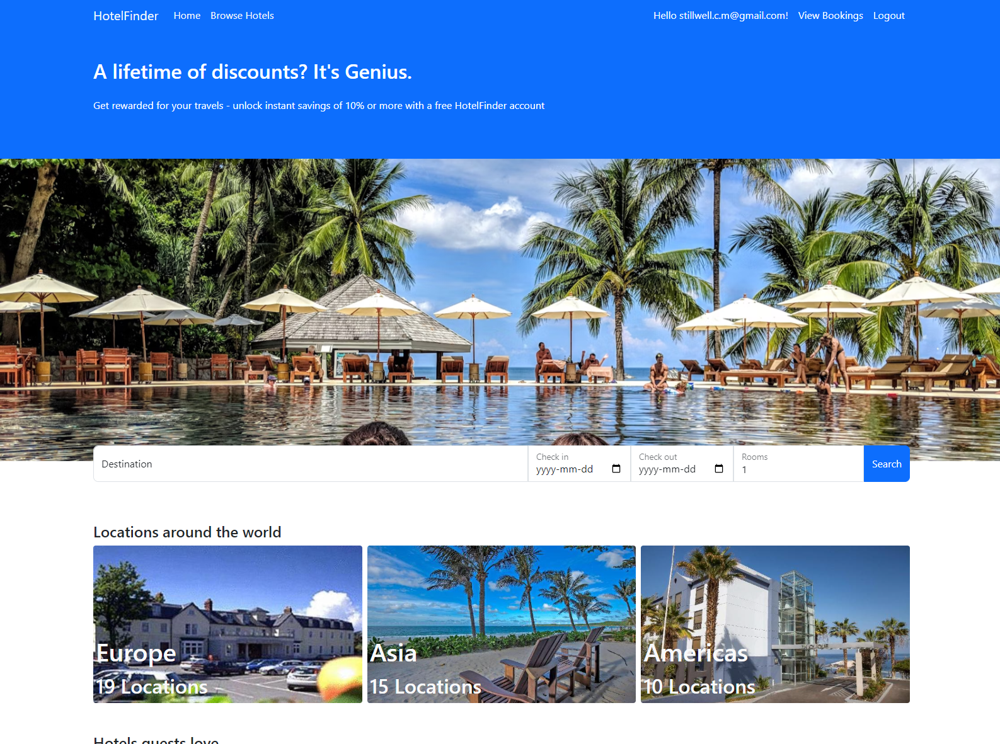
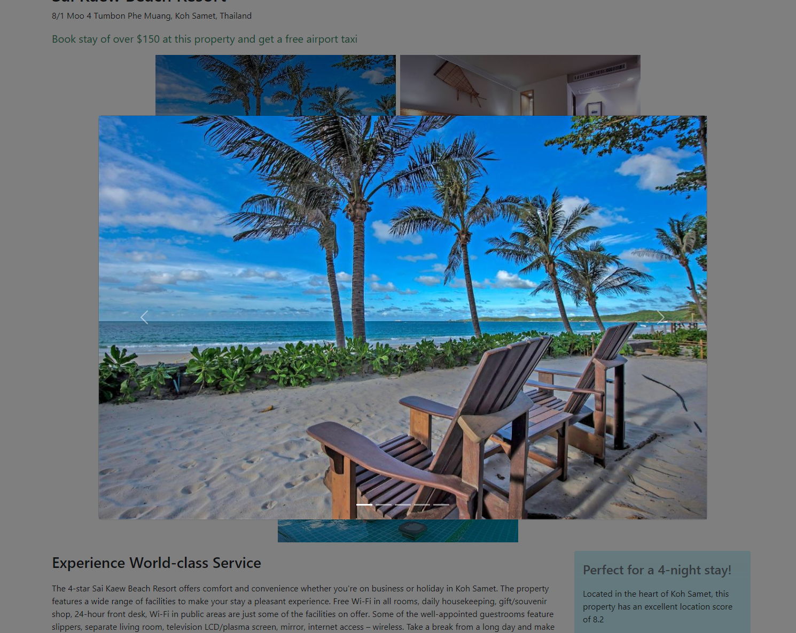
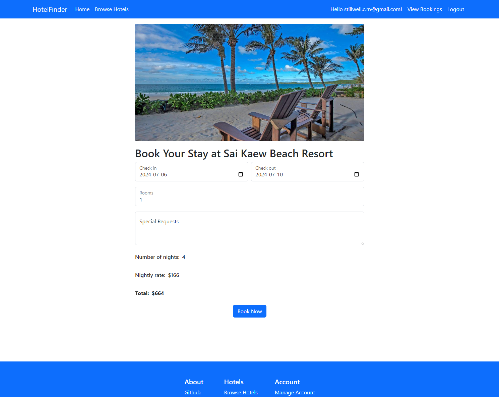
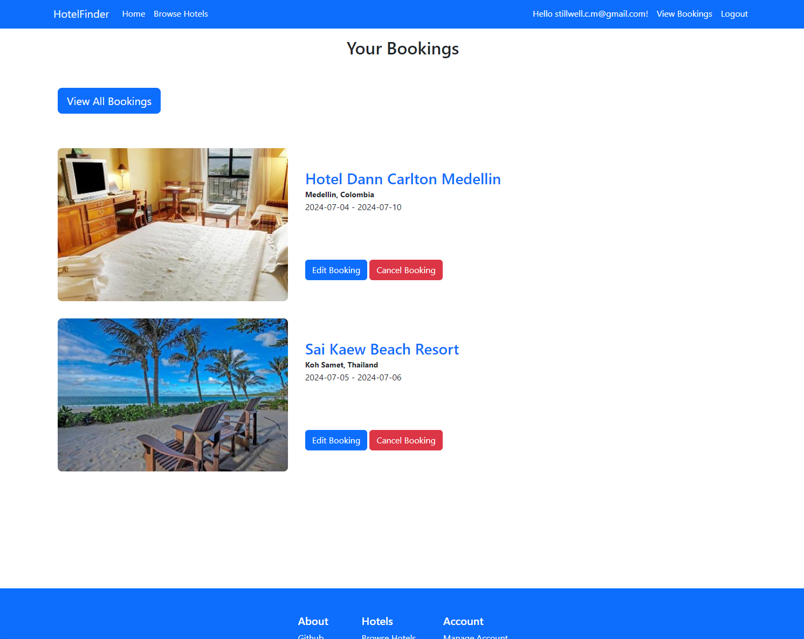
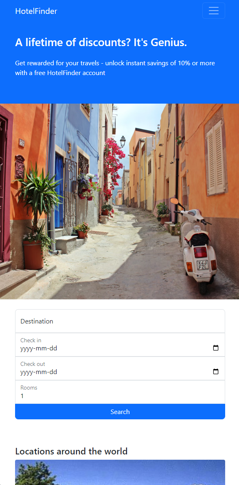
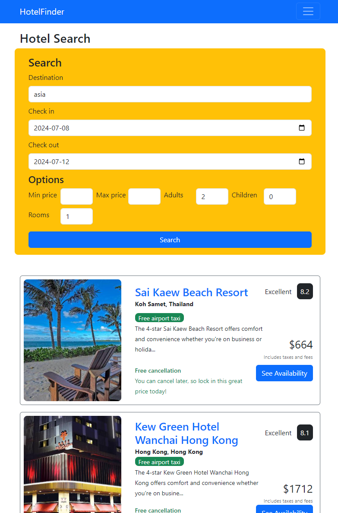

# Hotel Finder

This repository is the a hotel booking application made with ASP.NET Core 8 MVC.

## Demo

The application is live [here](https://aspmvchotelapp.azurewebsites.net).

## Contents

- [Description](#description)
  - [Overview](#overview)
  - [Detailed Description](#detailed-description)
    - [UI](#ui)
    - [API & Authentication](#api--authentication)
      - [Users & Authentication](#users--authentication)
    - [Users, Hotels, and Bookings](#users-hotels-and-bookings)
    - [Validation](#validation)
    - [Clean architecture](#clean-architecture)
- [Screenshots](#screenshots)
  - [Desktop](#desktop)
  - [Mobile](#mobile)

## Description

### Overview

- ASP.NET Core 8 MVC
- Reponsive, mobile-first UI
- Bootstrap
- jQuery
- Microsoft Azure
- Create account
- Search for hotels

### Detailed Description

This application is a simple CRUD application with authentication to practice using the core features of ASP.NET Core 8 MVC.

#### UI

The UI was made to be responsive with a mobile-first design and should function on both mobile devices and web browsers with larger screens. I decided to use bootstrap since I had never used it before to style the vast majority of pages. I also made use of bootstrap components such as the carousel, model, navbar and alerts, which helped speed up development.

#### API & Authentication

##### Users & Authentication

Account creation and authentication is done using the ASP.NET Core Identity API. Users can create an account and sign in using their email and a password. I have not made too many interventions in the functionality, but I plan to update the UI to make it seem less like a standard ASP.NET project.

#### Users, Hotels, and Bookings

To create an account, click one of the Sign in / Register buttons and create an account using an email and password. As there is currently no email confirmation associated with this application, the app will prompt you to click a confirmation link after creating your account.

The data used to seed the database with hotels was made by modifying [this data](https://gist.github.com/Thaer-Sarakbi/e92e818f0a2c9d5467cf68e8c8833d65). I have not made any major changes to the data apart from adding a timezone for each hotel, which is used for validation when creating a booking.

Users do not have to be signed in to search or view hotels, but will be required to sign in for any tasks relating to bookings (such as creating a new booking or viewing their bookings). Users are allowed to modify bookings where the check out date has not yet passed. These bookings are displayed on the current bookings tab of the View Bookings page and display edit booking and cancel booking buttons. All other bookings can be viewed under the View All Bookings tab and will not allow the user to cancel or edit the booking. Upon deletion or edit of a booking, the user will be given an alert or redirected to a separate page to show whether their requested action was successful.

The main database for this project is an SQL database and Entity Framework Core is used to access the data. A separate in memory database is also present and will be the default database if the project environment is set to QA.

#### Validation

Model validation is used to ensure appropriate data for all model data. For bookings (which are the primary form of data generated by the users in this application), validation attributes are used in addition to standard model validation to ensure accurate calculation of rates, user authentication, and valid start and end dates. Start date validation takes the time zone of a hotel into account when determining validity.

When validation fails, forms to create or modify bookings will display error messages to the user informing them of the error.

jQuery is used on the front end for some form validation such as setting the minimum dates for the start date and end date inputs. However, as this can easily be disabled using dev tools, all data is also validated on the backend before creating an entry into the database.

#### Clean Architecture

This project was created using use case based clean architecture where entities, business logic, database, UI are all separate to allow for maintainability and flexibility.

## ScreenShots

### Desktop

#### Homepage

#### Hotel Search

#### Hotel Page Image Carousel

#### Hotel Booking

#### View Bookings

### Mobile

#### Homepage

#### Hotel Search

